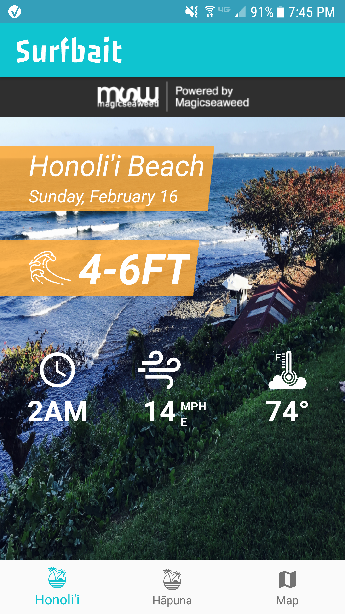
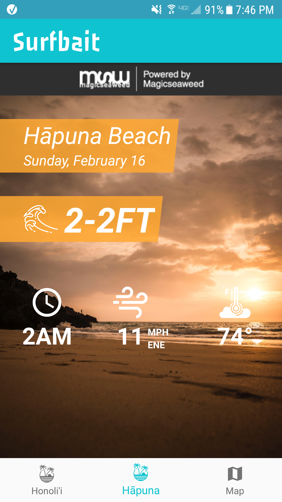
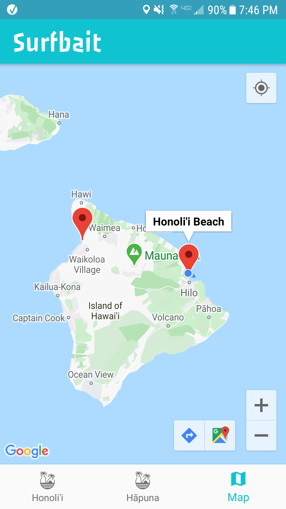

# Surfbait

For the AlgoExpert software engineering project contest, I created a mobile app that shows the surf forecast for Honoli’i and Hapuna Beach on the Big Island of Hawaii.

The app is called Surfbait. 

It pulls data from an API belonging to a surf forecast website called [Magicseaweed](https://magicseaweed.com/).

**Disclaimer: I am not sponsored by Magicseaweed. I created this app solely as a personal coding project.**

Per the terms and conditions of their API use, I have included the Magicseaweed logo on top of the content. When you click on it, you’ll go straight to the Magicseaweed website.

To access Magicseaweed’s API, you need to have a key. To get one you have to sign up through their website and give a few details of why you are requesting it. See details of Magicseasweed's API [here](https://magicseaweed.com/developer/api).

Each forecast shows the minimum and maximum swell height, the time frame of the swell, wind speed, wind direction, and the temperature. The earliest time frame is 2 AM. When you scroll up, later time frames are shown for the rest of the day. The last time frame available is 11 PM.

 

As an extra feature, I added a map fragment that shows a Google map of the Big Island of Hawaii with markers on both beaches to see where they are located. Honoli’i is on the east side of the island, Hapuna the west.

